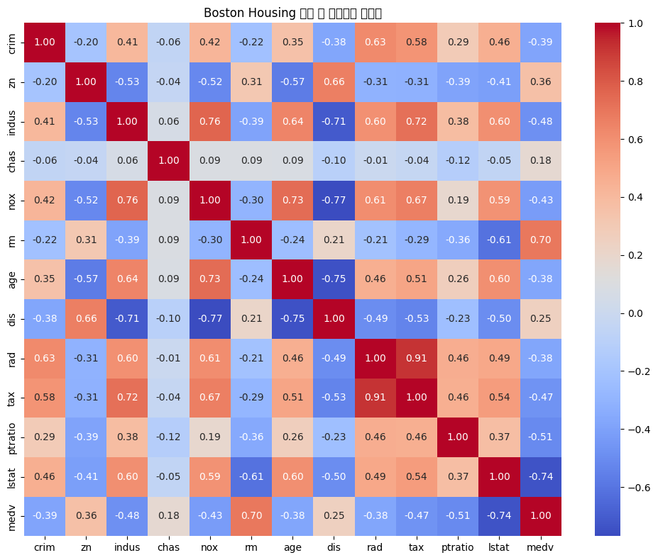
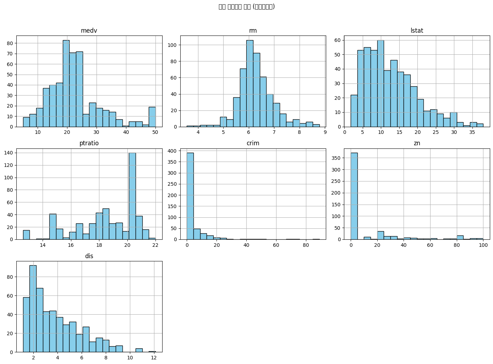
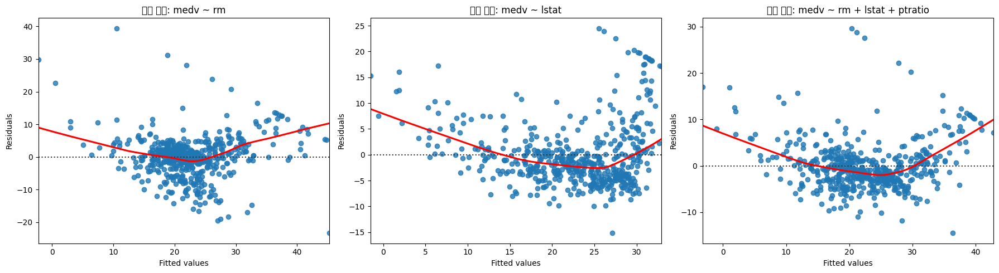

# boston-housing-regression

# 🏠 Boston Housing 회귀 분석 보고서

이 프로젝트는 Boston Housing 데이터를 기반으로  
주택 중위가격(`medv`)을 다양한 변수 조합으로 예측한 회귀 분석 실습입니다.

## 📁 파일 설명

### 히트맵

### 변수별 분포

### 잔차 플롯

## 📊 회귀 모델 요약

| 회귀 모델                 | 결정계수 (R²) | AIC 값 |
|---------------------------|----------------|---------|
| medv ~ rm                 | 0.484          | 3350    |
| medv ~ lstat              | 0.544          | 3287    |
| medv ~ crim               | 0.151          | 3602    |
| rm + lstat + ptratio      | **0.679**      | **3114** |

🔍 변수 선택 자동화 실험 (전진/후진 선택법)
scikit-learn의 SequentialFeatureSelector를 활용하여 변수 선택 자동화를 실험했습니다.

전진 선택법 결과: ['rm', 'dis', 'ptratio', 'lstat']

후진 제거법 결과: 동일한 결과 도출

두 방법 모두 동일한 변수 조합을 선택하였으며, 이는 수작업으로 도출한 다변량 모델(rm + lstat + ptratio + dis)과도 유사합니다.

🔎 전후진 선택법 결과가 동일하다는 점은 주요 변수들이 예측력에 안정적으로 기여하고 있음을 의미합니다.
이는 자동화 기법이 수작업 변수 조합의 신뢰도를 검증하는 데 유용하게 활용될 수 있음을 보여줍니다.

## ✅ 주요 결과

- `rm`, `lstat`, `ptratio`를 포함한 모델이 가장 성능이 좋았음
- 단변량보다 다변량 모델의 예측력이 훨씬 높음
- 잔차 플롯을 통해 선형회귀 가정을 잘 만족하는지도 확인함

## 🧪 실행 방법

1. Google Colab 또는 JupyterLab에서 `.ipynb` 파일 열기
2. 상단부터 셀을 순서대로 실행

---

📌 본 분석은 조별 실습 과제로 제출되었으며, 변수 조합 실험과 성능 비교를 중심으로 작성되었습니다.
